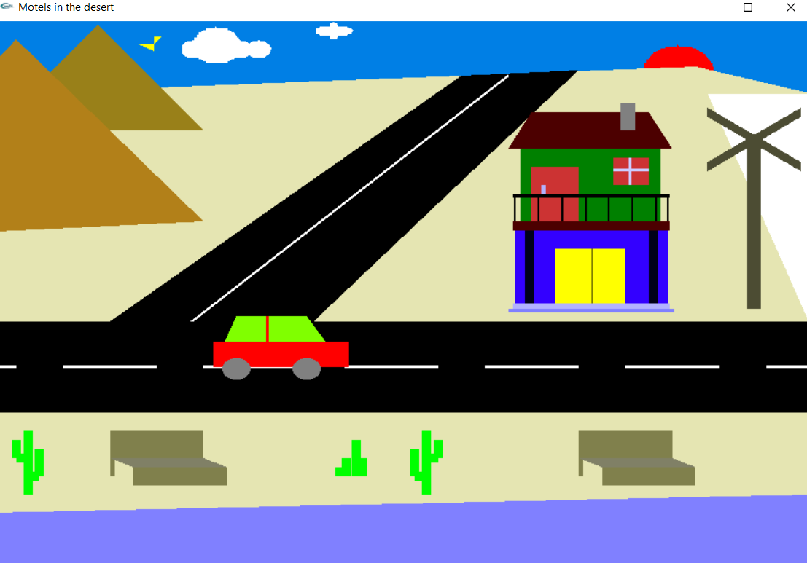

# OpenGL-Desert-Motel
 
Tried to create a desert view which includes: 
•	Sky 
•	Sun 
•	Bird 
•	Cloud 
•	Motel 
•	Desert 
•	Cactus 
•	Highway 
• benches 
•	Wind Fan 
•	River 
<h3>Also added a litte bit of animations and sound.</h3>
   
Sample of Desert Motel: 

## Use Glut file to It

> Glut Supporting File : <em>[Download](https://github.com/solimanhossain/openGL-desert-motel/blob/main/glut.zip?raw=true)</em> 
> Run Code on Codeblock : <em>[Tutorial](https://youtu.be/0Q7Bs7kiaKs)</em>
